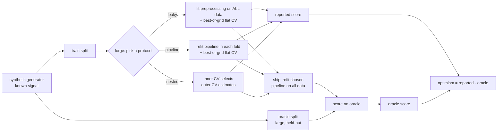

# MLForge

[](https://github.com/ranafaraz/MLForge/actions/workflows/ci.yml)
[](https://github.com/ranafaraz/MLForge)
[](LICENSE)

**A leakage-safe tabular model-selection forge.** It searches a grid of
from-scratch estimators and reports a cross-validated accuracy — but the point of
the project is to **measure how much that reported number lies**, and to fix it.
Two malpractices inflate the score you would put in a report; MLForge isolates and
corrects each one, scored against a held-out **oracle** that knows the truth:

> **Proper pipelining buys a preprocessing-leakage correction.**
> **Nested cross-validation buys a selection-bias correction.**

On a high-dimensional task the leaky-but-common protocol reports **0.871**
accuracy for a model that truly generalizes at **0.742** — a **+0.155** lie.
Pipelining removes most of it; nested CV removes the rest, reporting **0.755 vs a
0.743 truth**. On random-label data the leaky protocol manufactures **0.763**
accuracy out of pure noise; nested CV refuses, reporting **0.491**.

## Demo

```console
$ mlforge compare --dataset highdim --seed 0
dataset=highdim seed=0  (Bayes 0.814)
  protocol    reported   oracle  optimism  chosen
  leaky          0.882    0.729    +0.153  logistic(k=10;C=0.1)
  pipeline       0.826    0.776    +0.049  logistic(k=5;C=0.1)
  nested         0.811    0.776    +0.035  logistic(k=5;C=0.1)
```

*(Per-seed numbers vary; the [eval table](evals/RESULTS.md) pools 8 seeds.)*


*(placeholder GIF — `mlforge compare` runs in seconds, fully offline.)*

## Architecture



Three protocols search the **same** grid over the **same** data and ship the
**same** way. They differ by exactly one structural choice each, so each effect is
attributable:

- `leaky` → `pipeline` flips **only** where preprocessing is fit (all-data vs
  in-fold) → isolates **preprocessing leakage**.
- `pipeline` → `nested` flips **only** whether selection is nested; both ship the
  same model, so their oracle scores match → isolates **selection bias**.

## The metric: optimism, decomposed

`Optimism = reported CV score − oracle (true) accuracy`. Lower is more honest.
8 seeds per regime, offline, no API keys, no downloads
([full table](evals/RESULTS.md)).

### `highdim` — many features, few informative: both effects bite

| Protocol | Reported | Oracle | Optimism |
|---|---:|---:|---:|
| leaky (preproc on all data + best-of-grid) | 0.871 | 0.715 | **+0.155** |
| pipeline (no leak, best-of-grid) | 0.793 | 0.743 | +0.050 |
| **nested (honest)** | 0.755 | 0.743 | **+0.013** |

- **Preprocessing-leakage correction:** +0.155 → +0.050 optimism (**−0.105**).
- **Selection-bias correction:** +0.050 → +0.013 optimism (**−0.038**).

### `lowdim` — few all-informative features: the control

| Protocol | Reported | Oracle | Optimism |
|---|---:|---:|---:|
| leaky | 0.739 | 0.713 | +0.026 |
| pipeline | 0.737 | 0.720 | +0.017 |
| nested | 0.713 | 0.720 | −0.006 |

With nothing to overfit in feature selection, **all three protocols agree** — proof
the effects above are caused by the high-dimensional search, not by the protocols
themselves.

### `null` — random labels: true accuracy is 0.5

| Protocol | Reported | Oracle |
|---|---:|---:|
| leaky | **0.763** | 0.500 |
| pipeline | 0.563 | 0.501 |
| nested | **0.491** | 0.501 |

The leaky protocol manufactures **0.763** accuracy from labels that are pure noise,
by selecting features on the held-out rows. Nested CV reports **0.491**. This
collapse is the classic "how to fool yourself" result (Ambroise & McLachlan, 2002).

## Quickstart

```bash
pip install -e ".[dev]"

mlforge data    --dataset highdim       # describe a regime + its Bayes ceiling
mlforge compare --dataset highdim       # all three protocols side by side
mlforge select  --protocol nested       # one protocol in detail
mlforge eval                            # full benchmark -> evals/RESULTS.md

pytest -q              # tests
ruff check .           # lint
python -m evals.gate   # the CI quality gate (asserts the dissociation holds)
```

One-command Docker run (offline benchmark):

```bash
docker build -t mlforge . && docker run --rm mlforge
```

## Offline-first by design

Numpy is the **only** runtime dependency — the estimators (logistic regression,
k-NN, Gaussian naive Bayes), the scaler, the univariate feature selector, the
pipeline and all cross-validation are implemented from scratch. CI is green with
no API keys and no model downloads.

| Knob | Env var | Options |
|---|---|---|
| Selection protocol | `MLFORGE_PROTOCOL` | `nested` (default) · `pipeline` · `leaky` |
| Dataset regime | `MLFORGE_DATASET` | `highdim` (default) · `lowdim` · `null` |
| Backend | `MLFORGE_BACKEND` | `numpy` (default) · `sklearn` (`[sklearn]`) |

The optional `sklearn` backend re-runs the same three protocols with scikit-learn's
own `Pipeline` / `cross_val_score` / `StratifiedKFold` to confirm the from-scratch
numbers reproduce the reference implementations:

```bash
pip install -e ".[sklearn]"
MLFORGE_BACKEND=sklearn mlforge compare --dataset highdim
```

## Why this matters

Data leakage and model-selection bias are the two most common ways a tabular ML
result fails to reproduce in production. MLForge turns them from folklore into
**numbers you can audit**: a CI gate (`evals/gate.py`) fails the build if the
ordered dissociation stops holding, the control stops agreeing, or the null stops
collapsing. See [`docs/ARCHITECTURE.md`](docs/ARCHITECTURE.md) and
[`docs/DECISIONS.md`](docs/DECISIONS.md).

## License

MIT — see [LICENSE](LICENSE).
