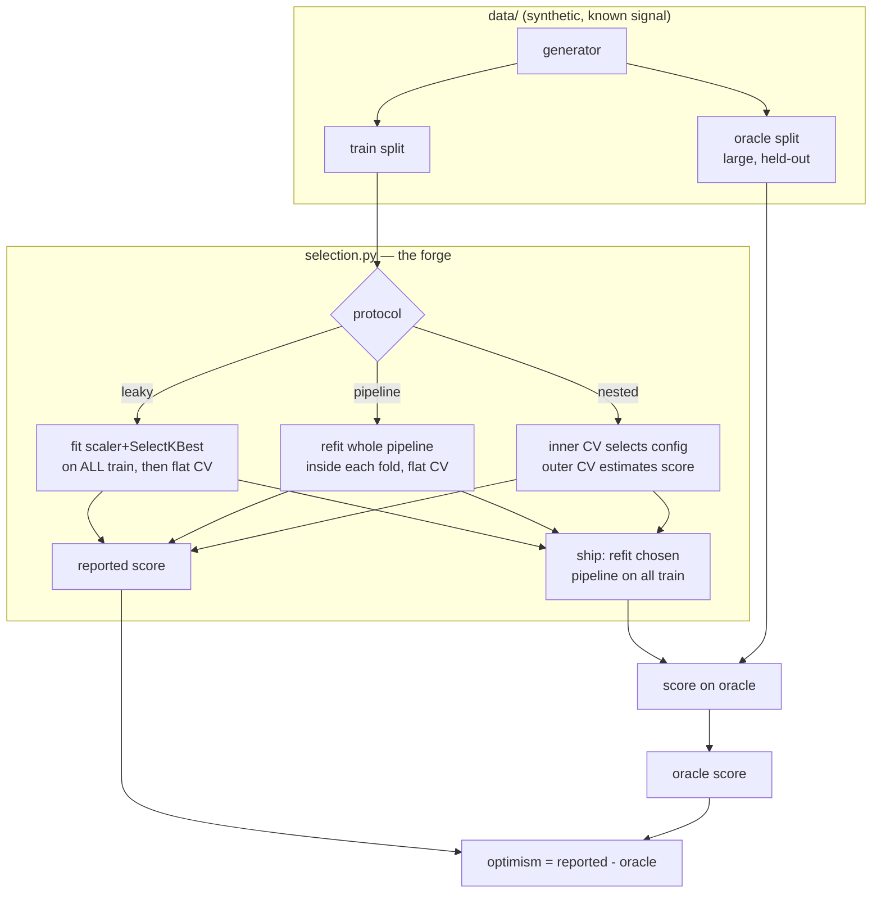

# Architecture

MLForge measures how much a model-selection procedure *lies to you*. The whole
system is built so that exactly one thing changes between the three protocols —
how the evaluation is wired — while the data, the model grid and the shipped model
are held fixed.

## Components

| Module | Responsibility |
|---|---|
| `data/synthetic.py` | Deterministic generator: a logistic-link signal on a few informative features plus noise features, with a known Bayes ceiling. Emits a small **train** split and a large **oracle** split from the same process. Three regimes: `highdim`, `lowdim` (control), `null` (random labels). |
| `preprocessing.py` | `StandardScaler` and `SelectKBest` (top-k by absolute point-biserial correlation). `SelectKBest` is the component leakage flows through. |
| `estimators/` | From-scratch `LogisticRegression` (GD + L2), `KNNClassifier`, `GaussianNB`; a `clone` primitive; a factory exposing the model zoo and the search grid. |
| `pipeline.py` | A scikit-learn-style `Pipeline` (scale → select → estimator). Refitting it refits its preprocessing — the mechanism that prevents fold leakage. |
| `cv.py` | `stratified_folds` and a generic `cross_val_score` that fits a *fresh* model per fold. The single splitting engine all protocols share. |
| `selection.py` | The three protocols. Each searches the same grid and ships the same way; they differ only in where preprocessing is fit and whether selection is nested. |
| `evals/` | Harness (optimism across regimes and seeds → `RESULTS.md`), aggregation, and the CI gate. |

## Why the design isolates each effect

- **Preprocessing leakage** is *only* the question of whether `SelectKBest` (which
  uses the labels) is fit on all the data or inside each fold. `leaky` does the
  former, `pipeline` the latter; everything else is identical, so their gap is the
  leakage effect alone.
- **Selection bias** is *only* the question of whether the best-of-grid CV score is
  reported as-is or re-estimated by an outer loop. `pipeline` and `nested` ship the
  **same** model, so their oracle scores match and their reported-score gap is the
  selection-bias effect alone.
- The **oracle** is large and never seen during selection, so it is an unbiased
  ground truth for "what the shipped model actually generalizes to."
